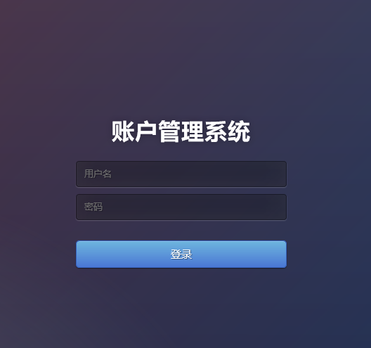
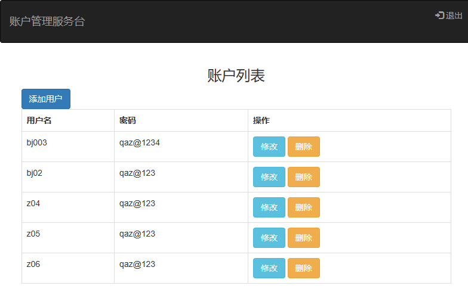
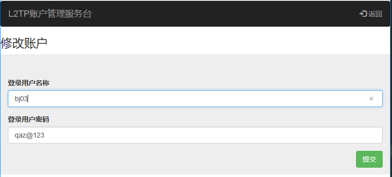

## l2tp 账户管理系统

#### 说明: 该软件为管理l2tp服务在使用前请先自行安装好l2tp服务，直接读取你l2tp的配置文件，在使用时需要安装python3.6环境具体看下面步骤：

##### 1. 安装python3.6 (如系统环境已经安装请忽略此步骤)
```textmate
# 安装python3.6可能使用的依赖

yum install -y openssl-devel bzip2-devel expat-devel gdbm-devel readline-devel sqlite-devel zlib zlib-devel

yum install -y readline-devel.x86_64  # (一定要安装这个包，不然升级完成后会发现删除退格键用不了)

wget https://www.python.org/ftp/python/3.6.3/Python-3.6.3.tgz
tar zxvf Python-3.6.3.tgz
cd Python-3.6.3
./configure --with-ssl --prefix=/usr/local/python3.6
make
make install
ln -s /usr/local/python3.6/bin/python3.6 /usr/bin/python3.6
ln -s /usr/local/python3/bin/pip3.6 /usr/bin/pip3
```
##### 2.安装 Flask
```textmate
pip3 install flask
pip3 install gevent-websocket

```
##### 3.配置环境
```textmate
mkdir myproject
cd myproject/
python3.6 -m venv venv
source venv/bin/activate
deactivate
```
##### 4.配置代码文件
lt_web/config/settings.py
```python
filedata_dir = os.path.join(BASE_DIR,"data")  #读取您的文件目录 (例如：/etc/系统目录下或者把配置文件放在本系统的data目录下然后以软链接的方式到相关服务的配置目录)

filedata_path=os.path.join(filedata_dir,"chap-secrets")  # 配置文件

filedata_path_bak = os.path.join(filedata_dir,"chap-secrets.bak")  # 备份配置文件 (修改的时候需要使用请一定要与配置文件名称一样)

userinfo_path = os.path.join(filedata_dir,"userinfo")  # 用户文件
```

##### 5.上传代码到您的服务器上并运行即可,你也可以搭建uwsgi+nginx+flask发布本程序
```textmate
cd myproject/lt_web/;python3.6 manager.py /dev/null 2>&1 &
```
##### 6.以上为完整的使用方式,启动到6步骤的时候可以在你的浏览器中访问即可。(访问账户信息在本系统中data目录下的userinfo下)

##### 7.添加账户
本系统中data目录下的userinfo下一行行添加账户与密码信息

##### 8.本系统效果展示：
登录效果：



首页展示效果：



添加效果：


